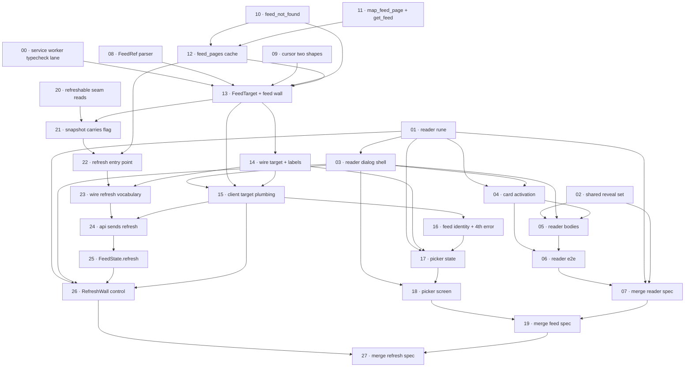

# Plan: Build the three pending change specs

**Status:** In progress · **Layout:** kanban · **Date:** 2026-07-26 · **Owner:** Ant Stanley · **Source spec:** [`.specs/changes/2026-07-26-read_a_brick_in_place.md`](../../changes/2026-07-26-read_a_brick_in_place.md), [`.specs/changes/2026-07-26-lay_a_bluesky_feed.md`](../../changes/2026-07-26-lay_a_bluesky_feed.md), [`.specs/changes/2026-07-26-refresh_the_wall.md`](../../changes/2026-07-26-refresh_the_wall.md)

One plan for all three pending change specs, because they are not three
independent builds: they collide on eleven surfaces, two of them regenerate the
same generated wire fixture, and two of them open a history-state dialog through
the same `App.PageState` interface that does not exist yet. The decomposition is
28 tasks in four milestones, numbered `00` to `27`, ordered so each shared surface
is touched **once, in its final shape**, by whichever spec rewrites it, and only
appended to afterwards. The spine is: the reader first (it creates
`App.PageState` and the overlay language the picker copies, and carries no wire
surface at all), the feed second (it rewrites `handle_feed`, `fetchFeed` and
`FeedState.reset`, which the refresh work then appends a single argument to), and
refresh last (every one of its collisions is an append onto something the first
two rewrote). Where a task ships a `.svelte` file, the plan says so and names
Playwright as its only lane rather than citing a green typecheck.

Task `00` is numbered zero rather than slotted in beside the work it protects,
because it was added after the graph was drawn and an id here is how the
dependency graph refers to itself. It runs first and it is not part of any spec:
it is the lane that has to exist before task 13 changes the arity of the one call
nothing in this repo typechecks.

---

## Source and definition-of-done baseline

- **Spec.** Three change specs, all `Proposed` on 2026-07-26, listed as pending in
  [`.specs/README.md`](../../README.md). Each carries `Proposed changes` blocks
  against the canonical pages, `Implementation notes`, and (for two of them) a
  `Type changes` fragment for
  [`canonical-types.schema.json`](../../canonical-types.schema.json). The
  canonical pages describe the current branch and stay correct until each spec's
  merge task runs.
- **Already built.** Everything the three specs build on, verified by reading the
  branch rather than the specs' description of it: `handle_feed` and the
  snapshot/fill/mixer machinery (`server/crates/mortar-core/src/feed.rs:44`),
  the `sources/` seam with its two fast content readers
  (`sources/fetch.rs:143`, `:177`), the single-shape cursor
  (`algo/cursor.rs:8`), the four-variant error vocabulary (`error.rs:4`), the
  wire drift guard (`tests/contract.rs`, `tests/fixtures/contract.json`,
  `web/src/lib/types.ts`, `web/src/lib/contract-check.ts`), `FeedState` with its
  warm/freeze/paginate loop and session cache (`web/src/lib/state/feed.svelte.ts`),
  the four card renderers, `BrickShell`, `Sensitive`, `VideoPlayer` and the
  one-video-at-a-time `player` rune, and the single Playwright spec
  (`web/tests/service-worker-smoke.test.ts`). None of that is scheduled as a
  task.
- **Definition of done.** [`.specs/development-guidelines.md`](../../development-guidelines.md)
  §Definition of done and §Limits and bounds. Every task inherits: a test at the
  right tier, negative-space tests for every new rejection path, named constants
  for new bounds, a *why* comment on every non-obvious line, `just check` green,
  `just wasm` run when the engine changed, wire agreement across `model.rs` /
  `contract.json` / `types.ts` / this spec set when the wire changed, and a
  changeset for user-visible change. Task files add only task-specific
  acceptance on top.

### Three corrections the specs have since absorbed

The specs' `Implementation notes` were wrong in three places against the current
branch when this plan was drawn, and the plan routed around all three. Commit
`b55ef455` then corrected the change specs themselves, so each is now block text:
the merge tasks confirm it landed rather than writing it in by hand, and the build
tasks below already say what the code allows.

1. **`FeedGrid`'s `brick` snippet carries no index.** It is
   `{#snippet brick(item: Brick, priority: boolean)}` at
   `web/src/lib/components/FeedGrid.svelte:204`, typed `Snippet<[Brick, boolean]>`
   in `Bento.svelte:12` and `Masonry.svelte:12`. Task 01 therefore has the reader
   hold the brick and derive its position by id, which keeps `FeedGrid`, both
   layout components and all four cards out of the reader's diff, and removes a
   collision with task 15. The reader spec's Reactive state block now says so
   itself, under "The reader holds the brick, and locates it by id".
2. **Two of the four cards give `BrickShell` no `href`.**
   `VideoCard.svelte:51` is `<BrickShell accent="video" {label}>` and
   `GlazeCard.svelte:132` is `<BrickShell accent="post" {label}>`. A
   `BrickShell`-only intercept would leave the whole glaze wall and every video
   brick with no way into the reader, so task 04 names three activation points,
   as the reader spec's Cards block and its note 6 now do.
3. **The reader mounts outside the element it makes inert.**
   `+layout.svelte`'s wrapper div opens at `:110` and closes at `:134`, so
   `{@render children()}` at `:133` is inside it and `inert` is inherited. Task 03
   mounts `BrickReader` after the wrapper's closing tag; the reader spec's note 8
   (note 7 before the correction) now names `:134`, and its Dialog behaviour block
   calls the reader the wrapper's sibling.

The same commit corrected a fourth thing that never reached this plan's shape: the
reader claims `VideoPlayer` under `reader:<brick.id>`, not the brick's own id, or
the card behind the scrim keeps playing. Task 05 builds it and task 07 confirms
the merged page says it, which is why that task counts four corrections and this
section counts three.

---

## Task graph

The dependency table is the **source of truth**; the Mermaid graph visualizes it.
If the two ever disagree, the table wins.

| Task | Depends on | Edge kind | Produces (reviewable artifact) |
|---|---|---|---|
| 00 · service worker typecheck lane | none | none | `web/src/service-worker.ts` enters a tsc program for the first time, so the positional `feed_page` call has a compiler looking at it |
| 01 · reader rune and page state | none | none | `App.PageState` exists with `brick?: string`, and every open/close/step/modifier-key decision is in one vitest-covered module |
| 02 · shared reveal set | none | none | a brick uncovered once stays uncovered, and the demo wall has a covered brick to prove it with |
| 03 · reader dialog shell | 01 | build | a dialog opens over the demo wall, traps focus, locks scroll and closes four ways |
| 04 · card click activation | 01, 03 | build, review | a plain left click on any of the four card kinds opens the reader; every modified click still reaches the source |
| 05 · reader bodies and stepping | 02, 03, 04 | build, data, review | the reader shows what the card left out, for all three kinds, and arrow keys step along the wall |
| 06 · reader e2e spec | 04, 05 | review | the only automated lane that renders `BrickReader` at all |
| 07 · merge the reader spec | 01, 02, 06 | review | canonical pages 00/07/08/09 describe the reader that shipped, corrections included |
| 08 · FeedRef parser | none | none | `?feed=` is parsed rather than forwarded, with every rejection path tested |
| 09 · cursor two shapes | none | none | a feed cursor round-trips and every cursor mason ever issued still decodes to the graph shape |
| 10 · feed_not_found error code | none | none | a fifth error code walks the whole forcing chain to `types.ts` in one green commit (**wire regeneration 1 of 3**) |
| 11 · map_feed_page and get_feed | none | none | one mapping path, shared, so a feed wall inherits moderation rather than reimplementing it |
| 12 · feed_pages cache | 10, 11 | build, contract | one page of a feed generator, cached for sixty seconds and never persisted |
| 13 · FeedTarget and the feed wall | 00, 08, 09, 10, 12 | build, data | `GET /api/feed?feed=<at-uri>` answers a page in the feed's own order, through both fronts, with the precedence rule in one testable mortar-core function rather than spelled out in each |
| 14 · wire target and hidden labels | 13 | contract | `query.target` and `vocab.hiddenLabels` pinned on both sides (**wire regeneration 2 of 3**) |
| 15 · client target plumbing | 03, 13, 14 | build, contract | `/?feed=<uri>` lays a wall with the header, the pickers and the bottom padding a graph wall gets |
| 16 · feed identity and the fourth error | 15 | build, data | the generator's face in the header, and "no such feed" instead of "fix your handle" |
| 17 · feed picker state | 01, 14, 16 | build, contract | recents, three queries and the hidden-tier filter, all in the one lane vitest can see |
| 18 · feed picker screen | 03, 17 | build, review | the second front door, from the landing page and from a laid wall |
| 19 · merge the feed spec | 07, 18 | review | canonical pages and the type schema describe the feed wall that shipped |
| 20 · refreshable seam reads | none | none | the two fast content reads become bypassable, with a cached-yield fallback, changing no behaviour yet |
| 21 · snapshot carries the refresh flag | 13, 20 | build | the flag reaches a detached fill and provably never reaches an extension wave |
| 22 · refresh entry point and both fronts | 12, 21 | build, contract | `?refresh=1` re-reads on a graph wall, bypasses `feed_pages` on a feed wall, and is ignored mid-scroll |
| 23 · wire refresh vocabulary | 14, 22 | contract | `query.refresh` and `FeedRefresh` pinned (**wire regeneration 3 of 3**) |
| 24 · api sends refresh | 15, 23 | build, contract | the client never sends a flag mortar would ignore |
| 25 · FeedState.refresh | 24 | build, data | a new wall in place, with the outgoing one left up and no twelve-card initial grid, in a module vitest still runs in node |
| 26 · RefreshWall control | 01, 03, 15, 25 | build, review | one header button that closes any open reader and lays the wall again, disabled while one is in flight |
| 27 · merge the refresh spec | 19, 26 | review | all three specs merged, the goals renumbered once, the pending list empty |

Each row keys a task by its **number and title**, not a path link: a task file
moves between `backlog/`, `in-progress/`, `blocked/` and `done/` as it is built,
and is found by globbing `*/NN-*.md`. `Depends on` always references lower
numbers.

Two edge kinds in this table need a note. Several `build` edges are **textual
collision edges**: 03 to 15, 03 to 18 and 03 to 26 exist because all four tasks
edit `web/src/routes/+layout.svelte`, and 13 to 21 exists because both edit
`server/crates/mortar-core/src/feed.rs` around lines 86 and 95. The edge fixes
which shape lands first so the second task writes against the final markup rather
than rebasing onto it. 03 to 18 is the sharpest of them and is not only a
mounting collision: task 03 introduces the wrapper's `inert` condition and task
18 **widens** it, because `FeedPicker` mounts beside `BrickReader` after the
wrapper's closing tag at `+layout.svelte:134` and the wrapper is what goes inert
behind either overlay, so the condition becomes
`page.state.brick || page.state.picker`. Written the other way round it is task
18 replacing task 03's condition rather than extending it, and the reader stops
making the wall inert. The `review` edges from 03 to 18 and 07 to 19 are the
reviewability rule on top of that: the picker is reviewed as a second instance of
the reader's dialog language, and the feed spec's goal numbering is only
checkable once the reader spec has claimed goal 8.

---

## Implementation order and milestones

**Order:** `00 … 27`, the numbering. Four departures from a naive
dependency-only sort, each deliberate:

- **Task 00 is a gate, not a feature, and it is first because it has to exist
  before the thing it watches changes.** It puts `web/src/service-worker.ts`
  into a tsc program for the first time, and task 13 is the first task to change
  the arity of the call that file makes. Landing it after 13 would mean the one
  edit it was built to catch is the one edit it never saw.
- **The reader leads, even though tasks 08, 09, 10, 11 and 20 have no
  dependencies either.** It creates `App.PageState`, which task 17 also needs,
  and it establishes the dialog language (`role="dialog"`, `aria-modal`, `inert`
  behind, focus in and back) that task 18 is reviewed as a second instance of.
  It is also the only one of the three specs with no wire surface, so it cannot
  interfere with either fixture regeneration.
- **The feed spec precedes refresh on every shared signature.** Feed *rewrites*
  `handle_feed`'s first parameter, `fetchFeed`'s first parameter, `FeedState.reset`
  and `#key`, and the exact call tuples in `feed.test.ts`. Refresh *appends* one
  argument to each of those. Appending onto a rewrite is one edit; rewriting under
  an append is two, and the second is a hand merge of positional arguments on a
  wasm-bindgen boundary where a transposition compiles.
- **The fixture is regenerated exactly three times, in a fixed order:** task 10
  (`errors.feed_not_found`), task 14 (`query.target`, `vocab.hiddenLabels`),
  task 23 (`query.refresh`). `UPDATE_FIXTURE=1` rewrites `contract.json`
  wholesale, so a regeneration on a tree that does not already carry the previous
  one silently deletes its keys and still passes `cargo test` on its own branch.
  Each of those three tasks must rebase on main first, and each names a committed
  diff containing only its own new keys.

**Parallelism.** The stated order is one valid serialization. Four stretches are
genuinely independent and can run concurrently by separate hands: task 00 (two
config files, no source change at all, and it must simply be in before 13), tasks
01 to 06 (client, plus one fixture field in `fixtures.rs` at task 02), tasks 08 to
12 (Rust only, no client), and task
20 (one Rust file, every caller passing a literal `false`, so it changes no
behaviour and can land at any point before 21).

**Milestones:**

| Milestone | Tasks | Demonstrable when complete | Review gate |
|---|---|---|---|
| M1 - read a brick in place | 01-07 | On `/?actor=demo`, a plain left click on a post, blog, video or glaze brick opens a dialog holding that brick's whole content; Escape and the back gesture close it; focus returns to the anchor; cmd-click still opens the source in a new tab | `just check` plus `just test-e2e`, with `web/tests/reader.test.ts` green. The reader spec is merged and `.specs/README.md` lists two pending, not three |
| M2 - a feed becomes a source | 00, 08-14 | `just dev-server`, then `curl 'localhost:8787/api/feed?feed=at://did:plc:z72i7hdynmk6r22z27h6tvur/app.bsky.feed.generator/whats-hot'` returns a page in the feed's own order; a malformed `feed` is a 400 that never lays somebody's graph | `cargo nextest run` green, `just guard-wasm` green, `just wasm && pnpm check:ci` green (which after task 00 genuinely includes `service-worker.ts`, typechecked against the regenerated `mortar_wasm.d.ts`), the positional-order Playwright case green, and the `contract.json` diff reviewed line by line |
| M3 - a feed becomes a wall | 15-19 | `/?feed=<uri>` lays a wall with the layout picker, the client picker and the generator's face in `SwitchWall`; the picker opens from the landing page and from a laid wall, and back closes it | `just test-e2e` with `web/tests/feed-picker.test.ts` green, and the honest statement in the PR that the five `.svelte` call sites have no typecheck coverage |
| M4 - refresh the wall | 20-27 | One header control lays a new wall in place with no reload: the outgoing bricks stay on screen, no twelve-card initial grid (the four-card warming tail at `FeedGrid.svelte:355`-`:363` does appear, and is expected), the control disables while one is in flight, and mortar re-read the two fast caches | `just check`, `just test-e2e` with `web/tests/refresh.test.ts` green, and all three change specs in `.specs/changes/merged/` with an empty pending list |

---

## What this plan deliberately does not do

- **It does not thread a brick index through `FeedGrid`.** The change spec assumes
  the `brick` snippet already carries one. It does not, and adding it means
  editing the snippet signature, both layout prop types, both render calls, all
  four cards and `BrickShell`, none of which any lane typechecks. The reader
  locates its brick by id instead.
- **It does not add replies, thread context or a parent post to the reader.** The
  change spec sized and deferred that on 2026-07-26; the plan does not reopen it.
- **It does not render a blog's article body.** The `site.standard.document`
  content union is platform-specific and mason never parses it, on the wall or in
  the reader.
- **It does not make a brick addressable.** No `?brick=` parameter and no
  single-brick lookup: the reader is history state only.
- **It does not bypass the `follows` cache on a refresh.** A new follow will not
  appear until the hour expires. `get_follows_cached` deliberately does not cache
  a partial graph and chases the tail in a background task, so a bypass needs care
  rather than an argument, and the change spec left it open.
- **It does not add pull-to-refresh.** It competes with the browser's own
  overscroll gesture and needs a threshold, a rubber band and a reduced-motion
  path.
- **It does not keep reposts on a feed wall.** The shared mapper drops
  `reason != null`, which is the whole point of sharing the mapper; keeping them
  would need `Brick` to carry reposted-by attribution, which is a wire field.
- **It does not cache or mirror the popular-feeds list.** Browse and search both
  ride `app.bsky.unspecced.getPopularFeedGenerators`, which carries no stability
  promise; the plan makes browse-unavailable a first-class state instead.
- **It does not touch `architecture-principles.md` or `development-guidelines.md`,
  and it changes exactly two rows of `.specs/10-build-release-deploy.md`.** No new
  crate, no new build mode, no new justfile recipe; the only justfile edit is one
  word, task 00 giving `test` the `wasm` dependency `dev`, `build`, `test-e2e` and
  `deploy` already carry. The first row is task 00's: it puts a second tsc project
  inside `pnpm check:ci`, and therefore inside `just test` and `just check`, so the
  `just test` row at `10-build-release-deploy.md:54` has to say two tsc projects
  rather than one, and that the recipe builds the wasm first.
  The second is task 27's: the `just test-e2e` row at `:55` calls the lane "the
  Playwright service-worker smoke", and by the end of this plan `web/tests/`
  holds four specs, so the row is reworded once, at the end, by the only task
  that runs after all four exist. Nothing else about the gate moves.
- **It does not run `just test-e2e` inside `just check`.** That is a deliberate
  standing decision in the justfile (a gate past a minute is one people skip
  around), and this plan does not change it. CI is the enforcement point.

## Where the gate is blind

`just check` is `guard-dashes`, `guard-autoplay`, `guard-toolchain`, `fmt-check`,
`guard-wasm`, `lint`, `test`, and `test` is `cargo nextest` plus `tsc --noEmit`
plus vitest. **TypeScript 7 cannot parse `.svelte`, so zero component files enter
the tsc program, and both vitest suites are `.ts` that import no component.**
`oxfmt` sees only the 17 `.ts` files under `web/src`, not the 22 `.svelte` ones.
Playwright (`web/tests/`) is the only lane that can render a component, and it is
not in `just check`.

Every task below whose deliverable is a `.svelte` file therefore ships with
`just check` proving compilation, knip reachability and the two greps, and
nothing else. Named honestly, task by task:

| Task | What ships uncovered by `just check` | What covers it instead |
|---|---|---|
| 03 · reader dialog shell | focus in/out, `inert` inheritance, scroll lock, Escape, click-away, the motion row | task 06 (Playwright) |
| 04 · card click activation | the wiring of `reader.activate` into five anchors across four cards, and the fact that `Sensitive`'s show-anyway button is a **descendant** of two of them (`PostCard.svelte:19`, `GlazeCard.svelte:201`) rather than a sibling | task 06 asserts the post-card path and, separately, that clicking "show anyway" reveals without opening the dialog; the modifier-key predicate itself is vitest-covered in task 01 |
| 05 · reader bodies and stepping | all three kind renderings, and the distinct player id that stops two videos playing at once | task 06 for the rendering; the double-player claim has **no lane at all** (playing a demo video needs an external m3u8 and the Playwright lane is otherwise network-free) and is a read-the-code plus one-manual-pass item |
| 02 · shared reveal set | `Sensitive.svelte`'s body, including the `stopPropagation` on its reveal button that keeps task 04 from turning a reveal into a reader open | the set itself is vitest-covered; the component becomes observable only once the fixture blur lands in this same task and task 06 asserts it, with a case that names `[role=dialog]` absent |
| 15 · client target plumbing | five `.svelte` call sites of the three changed signatures: `+page.svelte:22`, `FeedGrid.svelte:55`, `FeedGrid.svelte:263`, `LandingWall.svelte:16`, `HandleForm.svelte:21`, **plus the page's only `h1` at `+page.svelte:31`**, which reads `@{actor}'s wall on mason` and renders as `@'s wall on mason` the moment `{#if actor}` at `:26` widens to `actor \|\| feed` | task 15's own Playwright cases (`/?actor=demo` still lays, `/?feed=nonsense` renders header plus error panel, and the feed wall's `h1` text is read rather than assumed) |
| 16 · feed identity and the fourth error | `SwitchWall.svelte` and `FeedGrid.svelte`'s new panel | **nothing.** No offline e2e case can reach a live `getFeedGenerator` or a `getFeed` 404. The `.ts` half (`appview.ts`, `feedinfo.svelte.ts`, `#fail`) is vitest-covered and the PR says the rest is not |
| 18 · feed picker screen | `FeedPicker.svelte` and `FeedCard.svelte` entirely | task 18's own Playwright spec, with the AppView list stubbed or the browse-unavailable state used so the case needs no network |
| 26 · RefreshWall control | the disabled attribute that **is** the rate limit, the 375px header fit, the `reader.close()` that precedes `feed.refresh()`, and **the absence of any scroll call together with the reason for it**, including the reduced-motion path at `FeedGrid.svelte:184`, which freezes with no scroll event at all | task 26's own Playwright spec at a 375px viewport for the first three. The disabled window on the demo wall is short (a demo preview answers `warming: false` at `feed.rs:60`), so the mechanism is a single `page.evaluate` that clicks and reads `disabled` in one evaluated function. `context.route` is **not** an option: `service-worker.ts:290` answers `/api/feed` from wasm over compiled-in fixtures, so on the demo wall there is no network request to delay. **The absent scroll is covered by reading, not by a lane:** no Playwright case on the demo wall can discriminate the orderings, because `feed.rs:60` answers a demo preview with `warming: false`, so `#warm` freezes on its first poll in every one of them. The obligation is the handler and its comment, read |

Two further blind spots that are not about `.svelte`:

- **The service worker is not in the tsc program at all, so today nothing
  typechecks the `feed_page` call.** Not a stale-package problem, which is what
  an earlier draft of this plan said: `web/.svelte-kit/tsconfig.json`, which
  `web/tsconfig.json` extends, lists `../src/service-worker.ts` in its `exclude`
  array, and `cd web && pnpm exec tsc -p tsconfig.json --listFiles` returns zero
  hits for that path (it does list `web/tests/service-worker-smoke.test.ts`, so
  the absence is the exclude, not a glob miss). `web/src/service-worker.ts:16` is
  the only importer of `feed_page`, so `pnpm check:ci` covers that call site
  neither with a fresh `pkg/` nor a stale one, and CI is no better: it runs
  `just wasm` then `just check`, which is the same excluded program. **Task 00
  closes this**, with a second tsc project over `src/service-worker.ts` wired
  into `check` and `check:ci` (verified green against the tree as it stands, so
  the task is a config change and not a cleanup). Putting the file in a program
  is also what makes the gate's missing dependency bite, so task 00 fixes that in
  the same PR: `web/src/lib/mortar-wasm/pkg/` is gitignored, `just test` runs
  `pnpm check:ci`, and `just check` runs `test`, so without a `wasm` dependency
  the whole gate would fail on any tree that has never built the engine.
  `test: wasm` is the one-line fix, `guard-wasm` cannot stand in for it (it is a
  `cargo check` that emits no `pkg/`), and after it the wasm the worker project
  typechecks against is fresh by construction, in the local gate and in CI alike.
  What task 00 still cannot see is **a transposition**. `feed_page` ends this
  plan as six positional `Option<String>` slots, and swapping two of them
  typechecks. That needs a behavioural lane, so tasks 13 and 22 each carry a
  Playwright case that sends `cursor`, `mode` and `intent` (and, at 22,
  `refresh`) on one demo request and asserts the engine acted on each slot
  separately. `web/tests/service-worker-smoke.test.ts` cannot do this: it sends
  `?actor=demo` alone, so every slot after `actor` is `undefined` and all five
  transpositions look identical to it.
- **A wiremock test module gated with a bare `#[cfg(test)]` breaks the wasm32
  build without breaking any test.** `wiremock` and `tokio` are
  `cfg(not(target_arch = "wasm32"))` dev-dependencies
  (`server/crates/mortar-core/Cargo.toml:41`) and `guard-wasm` compiles test
  targets with `--all-targets`. `just guard-wasm` is the only gate that can see
  this, and two tasks walk into it from opposite directions.
  `sources/fetch.rs:373` is a bare `#[cfg(test)]` module today, so task 20's new
  tests must go in a *second* module gated
  `#[cfg(all(test, not(target_arch = "wasm32")))]`. `algo/fill.rs` has **no test
  module at all**, so task 21's wave test is the *first* one in that file and has
  nothing to copy the gating from; it carries the same instruction for the
  opposite reason. Tasks 12 and 22 add wiremock tests to files that already have
  a correctly gated module and simply extend it.

---

## Assumptions and open questions

**Assumptions**

- The three change specs' own assumptions hold and are not re-litigated here:
  SvelteKit 2 shallow routing works under `adapter-static` with `ssr=false`,
  `inert` is available above mason's stated browser floor,
  `app.bsky.feed.getFeed` and `app.bsky.feed.getFeedGenerator` are readable
  unauthenticated with wildcard CORS, and `getFeed` hydrates into the same
  `PostView` shape `getAuthorFeed` returns.
- All 28 tasks land as PRs off `main` in the stated order, per
  [`.specs/development-guidelines.md`](../../development-guidelines.md) §Version
  control. Stacked PRs need a rebase between squash merges.
- `just check` is green on `main` before task 00 starts, and is run before every
  task is handed to review.

**Decisions**

- *One plan, not three.* **The three specs collide on eleven surfaces, so the
  ordering is the deliverable.** Three separate plans would each be correct and
  the second and third would each inherit undocumented rebase work on
  `handle_feed`, `feed_page`, `FeedParams`, `fetchFeed`, `feed.test.ts`'s call
  tuples, `contract.json`, `App.PageState`, `+layout.svelte`, `feed.svelte.ts`,
  `FeedGrid.svelte` and the shared canonical tables.
- *The reader leads.* **It creates rather than rewrites.** Its contributions to
  every shared surface are additions (`App.PageState` from nothing, a sibling
  mount and one attribute in `+layout.svelte`, new rows on the 07 and 08 tables),
  it touches no Rust except one fixture field and no wire at all, and the picker
  in task 18 is reviewed as a second instance of the dialog language it
  establishes.
- *The feed spec owns every shared signature's final shape.* **Rewrites before
  appends.** Task 13 lands `handle_feed(state, target, cursor, mode, intent)` and
  task 22 appends `refresh: bool` to it; task 15 lands `fetchFeed(target, ...)`
  and task 24 appends `refresh?: boolean`. The `feed_page` wasm export is fixed
  once, in task 13, as `(actor, feed, cursor, mode, intent)` with `refresh`
  appended in task 22, and `web/src/service-worker.ts:260` passes all of them
  positionally, so the order is written down here rather than rediscovered.
- *That positional boundary gets a compiler and a behaviour, not one or the
  other.* **Task 00 buys the arity, the Playwright cases in 13 and 22 buy the
  order.** Six `Option<String>` slots in a row is a shape where the type system
  can only ever count, so the counting is made real (task 00 puts the call in a
  tsc program for the first time) and the ordering is asserted by driving one
  demo request that carries `cursor`, `mode` and `intent` at once and reading
  three independent effects out of the answer.
- *The refresh spec owns both cross-spec obligations the other two named.*
  **Because it is last by construction, neither is orphaned.** Task 22 owns the
  `feed_pages` bypass on a feed wall (the feed spec assigned it to whoever merges
  second) and task 26 owns closing an open reader on refresh (the reader and
  refresh specs both assigned it to whoever merges second).
- *The reader close hangs off the control, not off `FeedState`.* **`FeedState`
  must not import the reader.** `reader.svelte.ts` already imports the `feed`
  singleton (it calls `feed.freeze()` and derives its index from `feed.items`),
  so a `feed.svelte.ts` that called `reader.close()` would be a cycle between two
  singleton modules, and it would drag `$app/navigation` and `$app/state` into
  `feed.test.ts`'s module graph, which runs in vitest's `node` environment and
  today mocks `$lib/api` precisely to keep `$app/*` out of it. `RefreshWall`
  imports both singletons and calls `reader.close()` before `feed.refresh()`, so
  the dependency points one way and `FeedState`'s no-DOM claim stays checkable.
  Task 26 also records that with a reader open the control is inside task 03's
  `inert` wrapper and therefore not clickable, so the call is a guarantee for any
  future trigger rather than a live path today.
- *A refresh announces nothing new.* **The wall keeps its one polite live region.**
  The refresh spec settles this in its `08` Refreshing block rather than leaving it
  to the control: `FeedGrid.svelte:221` already says "laying bricks" while warming,
  a refresh is a warm, and `RefreshWall` adds no region of its own. So task 26 adds
  none and gives `FeedGrid` no refresh-aware branch, which would have needed
  `FeedState` to expose that this warm is a refresh; and the count in
  `08-wall-and-bricks.md`'s accessibility section, exactly one region for the whole
  wall, stays true.
- *The two overlays get one mutual-exclusion rule, written once.* **Opening
  either clears the other's `App.PageState` key.** Task 01 declares
  `brick?: string`, task 17 adds `picker?: 'feeds'` to the same interface rather
  than replacing it, and task 17 owns the rule. The picker is a landing surface
  and the reader is a wall surface, so in practice they rarely coexist; the rule
  exists so the rare case is decided rather than emergent. **Both halves are
  `.ts`, deliberately:** the reader pushes from `reader.svelte.ts` and the picker
  from `feeds.svelte.ts`'s `openPicker()` / `closePicker()`, which task 18's
  components call. A `pushState` inside `FeedPicker.svelte` would put half of a
  rule task 17 claims to own in the one file neither tsc nor vitest can see.
- *The precedence between `actor` and `feed` lives in mortar-core, not in either
  front.* **It is the only crate the tests can reach.** Task 13 puts
  `FeedTarget::from_query(actor, feed)` in `feed.rs` holding both halves (feed
  wins, neither is a `bad_request`), and both fronts call it. `mortar-server` has
  no `#[cfg(test)]` module anywhere in its `src`, and `tests/contract.rs` is a
  mortar-core integration test that can see neither front crate, so a rule
  written in the axum route ships untested and a fixture key retyped beside it
  pins nothing. With the parse in mortar-core, task 14's `query.target` tokens
  get the same const-bound assert `GLAZE`, `PREVIEW` and `FREEZE` already have at
  `tests/contract.rs:347`.
- *A refresh spends one fan-out, and a marker is what holds it to one.* **The
  marker defers the second cursorless request; it does not send it unflagged.**
  `refresh()` issues `#warm`'s first preview synchronously with a null cursor,
  and `freeze()` proceeds while `warming` is true and `loading` is false with a
  null cursor of its own, so one tap would otherwise put two cursorless requests
  on the wire. Under reduced motion that is not a race but the default path:
  `FeedGrid.svelte:184` calls `freezeOnEngage()` the instant `warming` flips
  true, with no scroll event at all. Letting the second request go out with the
  flag merely stripped is not a fix, it is the defect: a cursorless request rolls
  its own `fresh_seed` (`feed.rs:78`, `snapshot.rs:334`), inserts a second
  snapshot and spawns a second, unflagged fill, and that fill is served by the
  still-valid five-minute `author_feed` entries (`fetch.rs:143` returns before
  any network), so it clears `FIRST_PAINT_AUTHORS` at once while the flagged fill
  is still working through up to a hundred rate-limited AppView calls. The
  unflagged request is therefore the one that commits, and what it commits is the
  pre-refresh wall. So task 25's marker holds the second cursorless request back
  instead: `freeze()` returns early, without side effects, while a flagged
  cursorless request is in flight, and once that preview resolves `#warm` has
  adopted its cursor (which carries the seed, `feed.rs:90`) and freezes from
  there, so the request that commits lands on the refreshing snapshot. Task 26
  states that in the file and task 27 copies what it says into `08`, so the rule
  is written down once and asserted once, in a vitest case that reads the
  **committed** request rather than counting flags.
- *The reader derives its position by id, it does not store an index.* **It
  deletes seven files from the diff and cannot point at the wrong brick.** A
  replaced or reordered `feed.items` yields -1 rather than a stale index, which is
  exactly what tasks 25 and 26's refresh needs, and it keeps `FeedGrid` out of the
  reader's diff so tasks 05 and 15 do not collide.
- *Three merge tasks, not one.* **The canonical pages describe the current
  branch.** Merging a spec before its code lands is a divergence, so each spec
  merges immediately after its own code, and task 27 owns the one-time
  reconciliation: the `00-overview.md` goal renumbering across all three, and the
  sentence at `.specs/README.md:47` that says three change specs are pending.
- *Task 10 walks the whole error-code forcing chain in one commit.* **It is
  indivisible.** Adding `AppError::FeedNotFound` breaks `status_and_code`'s
  exhaustive match, then `code_key`'s exhaustive match in `tests/contract.rs`,
  whose new arm must index `ALL_CODES` (a `[&str; 4]`, so a constant
  out-of-bounds index fails the build), and then the key-set assert in
  `contract()` until `errors()` carries an instance. The regenerated fixture then
  fails `pnpm check:ci` until `types.ts` follows. Split across commits, the repo
  is red in between.

  Two links a reader would expect in that chain are **not** in it, which is why
  task 10 verifies them by reading rather than by a green run. `error.rs`'s own
  `variants()` is a hand-written `[AppError; 4]` in its test module, and both
  pinned envelope arrays are consumed through `variants().iter().zip(expected)`;
  `zip` stops at the shorter side, so a five-entry `variants()` against a
  four-entry `expected` leaves both tests green with the new variant's wire
  strings unpinned.
- *Task 03 lands the component and its mount together.* **knip fails on an
  unmounted component.** `web/knip.json` treats `src/routes/**/+*.{svelte,ts}` as
  the entries, so a `BrickReader.svelte` that nothing renders is an unused file
  and `just lint` goes red.

**Open questions**

- *Should the picker prefetch a feed's first page?* `warmFeed` is **not** the
  question: task 15 decides once that `warmFeed(actor: string)` keeps its
  signature and a feed target simply skips the call, because a feed has no follow
  graph and no cohort to warm, and `HandleForm.svelte:21`'s
  `warmFeed(handle || 'demo')` is one of the five `.svelte` call sites nothing
  typechecks. The open part is the alternative nobody has evidence for: having
  task 18's picker prefetch the first `getFeed` page into `feed_pages` under the
  card the reader is about to activate. That is a new behaviour rather than a
  signature change, so it can land later without reopening task 15's diff.
- *Is a snapshot-id collision worth code?* `fresh_seed` is `xxh3(did, unix_millis)`
  and `ensure_snapshot` only runs its `make` closure on a genuine insert, so two
  cursorless requests for the same DID in the same millisecond share a snapshot
  and the second one's `refresh: true` is discarded with the closure that never
  ran. The control being disabled while one is in flight closes the double-tap
  path, so task 21 records it in prose rather than defending it. Open: does the
  merged `02-feed-engine.md` prose say the flag rides on snapshot *creation*, or
  does something enforce it?
- *Does the glaze page size need a bound of its own?* A feed wall under
  `Mode::Glaze` asks `getFeed` for 100 and lays every image post that survives,
  which can hand the client a page several times `PAGE_SIZE`. Task 13 names the
  100 as a constant and asserts the non-truncation; whether the client's
  `#replace` and dedupe path is comfortable at that size is proven by task 15's
  Playwright case rather than reasoned about here.
